# MNIST-over-Delta commission workspace

This loopback-only browser workspace demonstrates MNIST passing through existing
Delta component interfaces without changing Campaign 02 governance. MNIST is only
the workload: each of four distinct Python worker processes produces and seals
one independent canonical contribution before returning, while the parent sees
only display metadata and opaque files from the distributed arm. Existing Java
and C++ Delta components perform transport validation, durability, delivered-vote
quorum validation, typed-certificate validation, aggregation, Apply, and the
current-state transition.

The demonstrated protocol scope is
`POST_CONFIG_POST_AVAILABILITY_DEMO_SUBTRACE`. It is a workload integration trace,
not a refinement proof for the complete Delta lifecycle. MNIST supplies only four
node-local contributions; it does not replace or reimplement any Delta transition.

## Start the presentation

From the repository root:

```powershell
powershell -ExecutionPolicy Bypass -File tools/run-mnist-demo.ps1
```

The wrapper verifies or builds the native integration process, selects or
content-verifies and locally provisions the locked reference JDK 25, verifies the
four pinned Netty jars, compiles the Java relay, and opens a page bound only to
`127.0.0.1`. The operator then presses
**Запустить демо**; no paths, seeds, JSON documents, or protocol knobs are exposed.

Prepare the native/Java toolchain and dependency cache before the presentation:

```powershell
powershell -ExecutionPolicy Bypass `
  -File tools/run-mnist-demo.ps1 `
  -PrepareOnly
```

On a machine without the locked toolchain cache, the first non-offline preparation
downloads the 141 MB JDK archive, approximately 1.7 MB of Netty jars, and then the
demo downloads approximately 11 MB of pinned MNIST data. Every download is checked
against a committed byte length and SHA-256. After that, require a cache-only
demonstration:

```powershell
powershell -ExecutionPolicy Bypass `
  -File tools/run-mnist-demo.ps1 `
  -Offline
```

Generated runs stay below `artifacts/local/mnist-demo/`, which is excluded from
Git. A failed build, hash check, transport receipt, WAL operation, QC validation,
native model comparison, or trace check stops the demo; there is no success-mode
fallback.

## Hard no-hidden-aggregation criterion

`DEMO_PASS` is emitted only when all of the following are true:

1. MNIST admission and the four disjoint shards are content-bound.
2. Four distinct worker processes each compute only their own class statistics and
   seal one canonical `int16` contribution before returning. The distributed
   orchestrator receives no node-local numeric arrays—only process/display metadata,
   a path, byte length, and content ID.
3. The relay orchestrator signs five opaque transport entries per receiver (one
   framing workload plus four independently sealed contribution files). Java
   verifies each demo Ed25519 signature and moves the exact bytes over real Netty
   loopback TCP without numeric arithmetic. Before any vote, the native adapter
   requires exactly four relayed contribution files and byte-compares them with
   the four records embedded in the signed workload.
4. Every phase runs as native body materialization and vote, Java Netty delivery
   of the four exact vote frames to each validator, generic delivered-vote quorum
   validation, and only then typed Delta certificate validation. The next phase
   cannot vote until that sequence succeeds. This produces 24 durable unique vote
   frames, 24 per-validator phase certifications, and 28 Netty receipts including
   workload delivery.
5. `CertificateVoteRuntime` persists every phase vote before exposing its frame.
6. The generic quorum ID and typed certificate ID remain distinct. The generic
   `protocol::QuorumCertificate.qc_id` commits the four delivered vote IDs; its
   `body_hash` must equal the typed Delta certificate content ID.
7. Only after `consensus::validate_quorum` accepts that generic quorum does
   `ChainVerifier` validate the corresponding ISC, EC, APC, ParameterShardQC,
   AggregateRootQC, or ApplyQC. Each later phase reconstructs and validates the
   complete immutable predecessor chain.
8. The only cross-node numeric reduction is
   `delta::robust::reduce_parameter_shard` in the native core.
9. `delta::robust::build_plan` materializes the eligibility and aggregation-plan
   stage bodies. Parameter reduction starts only after both the generic APC quorum
   and typed APC verification; `delta::apply::compute_candidate` starts only after
   the corresponding AggregateRoot pair. `CurrentPointerStore` then reaches
   `APPLIED`.
10. The distributed result is evaluated only from native `applied-model.bin`; its
   bytes must equal the separately computed centralized baseline under the same
   integer profile.
11. The machine-readable execution trace contains the ordered component chain,
   source/toolchain identities, and records both
   `python_cross_node_aggregation_performed=false` and
   `distributed_orchestrator_received_node_local_numeric_arrays=false`.

The demo integration module has no `aggregate_summaries` function and Java has no
model-coordinate or aggregation API. Python does compute the explicitly labelled
centralized comparison arm, but neither that model nor its sufficient statistics
enter the distributed execution path. The opaque contribution files are readable
by the local parent account; this is a verified data-flow boundary, not OS-level
capability isolation. The demo-only native executable orchestrates production
libraries; it contains no alternate reduction algorithm.

## Executed path

```mermaid
flowchart LR
    A[MNIST dataset] --> B[4 isolated Python workers]
    B --> C1[worker 01 local seal]
    B --> C2[worker 02 local seal]
    B --> C3[worker 03 local seal]
    B --> C4[worker 04 local seal]
    C1 --> F[non-numeric framing: workload.bin + 4 files]
    C2 --> F
    C3 --> F
    C4 --> F
    F -->|relay signs; Java verifies exact bytes| D[Java Netty workload relay]
    D --> E[4 demo-only native adapters: bind all 4 files]
    E --> M[materialize current typed body<br/>ISC input; EC/APC robust::build_plan;<br/>shard robust::reduce_parameter_shard;<br/>root aggregate_merkle_root; Apply compute_candidate]
    M --> V[CertificateVoteRuntime:<br/>persist one vote per node]
    V -->|4 exact vote frames per receiver| T[Java Netty vote relay]
    T --> Q[consensus::validate_quorum:<br/>generic delivered-vote QC ID]
    Q -->|body_hash = typed certificate ID| G[ChainVerifier verifies typed<br/>ISC / EC / APC / shard / root / Apply]
    G -->|verified predecessor pair gates next phase body| M
    G -->|after typed ApplyQC| J[CurrentPointerStore: APPLIED]
    J -->|native model bytes| K[MNIST evaluation + UI]
```



For each phase, two content identities are reported and must not be conflated:

| Identity | Meaning |
| --- | --- |
| Generic delivered-vote quorum ID | `protocol::QuorumCertificate.qc_id`, derived from the four delivered vote IDs, body, and context |
| Typed Delta certificate ID | Content ID returned by the phase-specific `ChainVerifier.verify_*`; it equals the generic quorum's `body_hash` |

The repeated phase order is `ISC -> EC -> APC -> ParameterShardQC ->
AggregateRootQC -> ApplyQC`. Proposal/body construction alone is not certificate
acceptance: typed verification happens only after the generic quorum has passed.

The adapter boundary and its exact acceptance criteria are documented in
`integration/mnist-delta/README.md`. Every run also writes a run-specific diagram to
`delta-execution/execution-path.mmd`.

This is not the deployable `delta-node-java` service topology. The Java main and
native executable in `integration/mnist-delta/` are demo-only process adapters:
the Java adapter reuses production `BenchmarkTransport` and Netty code, and the
native adapter calls the existing production runtime, certificate, robust-reduce,
Apply, and current-pointer interfaces. The transport is loopback TCP without the
production TLS/peer-routing/WAN layer.

## Inspect one run

After a successful button press, the UI shows the participating component chain.
The underlying evidence remains inspectable in the run directory:

```text
delta-execution/execution-trace.json
delta-execution/execution-path.mmd
delta-execution/native-nodes/validator-*/trace.jsonl
delta-execution/native-nodes/validator-*/votes/runtime.wal
delta-execution/network/**/relay-evidence/*.json*
delta-execution/models/validator-*/applied-model.bin
```

`execution-trace.json` binds the contribution IDs, transport receipts, six generic
quorum IDs, six separate typed certificate IDs, model SHA-256, exact
executable/classpath hashes, source snapshot, ordered Delta library components,
terminal `APPLIED`, and crash/recovery observations. These inputs participate in
`execution_path_id`.
The repository also includes a human-readable excerpt from one successful full
MNIST run at `integration/mnist-delta/example-execution-trace.json`. The excerpt is
illustrative and non-authoritative: it is for inspection, not standalone proof,
and cannot replace a fresh complete run trace. Every live full-MNIST run writes its
own complete local trace. CI separately retains a complete small
synthetic-workload trace through the same component path; that CI artifact tests
the integration contract, not MNIST dataset admission or 60,000-image model
quality, and it is not the local full-MNIST trace summarized by the excerpt.

## Fault demonstration

Validator 04 is terminated after its Apply vote is durable but before the vote is
exposed. The same node directory is reopened, the durable journal is recovered,
and the identical vote is replayed through the normal transport/certificate path.
The run is accepted only after all four nodes converge on byte-identical APPLIED
model artifacts.

This is a local persistence/replay demonstration, not a multi-region availability
claim.

## Governance boundary

Every result is `LOCAL_DEMO_ONLY` and records:

```text
authoritative: false
governance_eligible: false
execution_authorized: false
feature_010_go_claimed: false
formal_refinement_claimed: false
protocol_scope: POST_CONFIG_POST_AVAILABILITY_DEMO_SUBTRACE
```

The Java transport signatures use real disposable Ed25519 demo keys. Native QC
signature IDs are explicit local-demo content-ID placeholders, not Ed25519 votes
from independent human/controller identities. Consequently, `ChainVerifier` is
exercised against the demo QC objects, but the run does not prove a cryptographic
controller quorum. It also does not create `BenchmarkDefinitionQC`,
`BenchmarkResultQC`, a real-WAN result, controller appointment, Feature 010 GO, or
Feature 011 authority. Recording the accepted `formal_semantics_id` binds the
expected semantics version; it does not turn this demo subtrace into a formal
refinement result. Controller governance remains a separate workflow.

MNIST attribution: Yann LeCun, Corinna Cortes, and Christopher J.C. Burges,
<https://yann.lecun.org/exdb/mnist/index.html>.
