# MNIST over Delta: isolated integration adapter

This directory contains the executable glue for the commission demonstration. It
does not add a second consensus implementation and it does not change the Delta
protocol. The adapter supplies an MNIST workload to the existing Java transport
and native Delta libraries and fails closed if any required production component
is absent.

The run-level and native evidence is classified `LOCAL_DEMO_ONLY`,
non-authoritative and ineligible for Campaign 02 governance. Java relay receipts
are byte-preservation observations only and confer no authority. A successful demo
is not Feature 010 GO, an execution authorization, a `BenchmarkDefinitionQC` or a
`BenchmarkResultQC`.

## Executed path

```mermaid
flowchart LR
    DS[MNIST train shards] --> W1[Python worker 01]
    DS --> W2[Python worker 02]
    DS --> W3[Python worker 03]
    DS --> W4[Python worker 04]
    W1 --> O1[worker 01 local seal]
    W2 --> O2[worker 02 local seal]
    W3 --> O3[worker 03 local seal]
    W4 --> O4[worker 04 local seal]
    O1 --> F[non-numeric framing: workload.bin + 4 files]
    O2 --> F
    O3 --> F
    O4 --> F
    F -->|relay signs; Java verifies 5 exact entries| N[Java Netty loopback transport]
    N --> A[demo-only native adapter: bind all 4 files to workload]
    A --> V[CertificateVoteRuntime / durable vote WAL]
    V --> Q[ChainVerifier / six QC phases]
    Q --> R[robust::build_plan and reduce_parameter_shard]
    R --> P[apply::compute_candidate / ApplyQC]
    P --> C[CurrentPointerStore]
    C -->|APPLIED model bytes| E[Python MNIST evaluation]
    E --> UI[local commission UI]

    classDef workload fill:#493813,stroke:#f7c948,color:#fff;
    classDef adapter fill:#32254f,stroke:#ba9cff,color:#fff;
    classDef delta fill:#102844,stroke:#57e39a,color:#fff;
    class DS,W1,W2,W3,W4,O1,O2,O3,O4,F,E,UI workload;
    class N,A adapter;
    class V,Q,R,P,C delta;
```

The Python worker processes own node-local workload computation and seal their own
canonical contributions before returning. The distributed orchestrator receives
no node-local pixel sums or model-coordinate arrays; it only validates opaque file
metadata, builds a framing envelope without numeric arithmetic, and later evaluates
the model emitted by native Apply. The local account can read those opaque files,
so this is a verified execution data-flow property rather than OS-level capability
isolation. A separately labelled centralized baseline exists for comparison, but
its model and sufficient statistics never enter the distributed path.

The Java side verifies the demo Ed25519 transport signature and moves the exact
payload bytes through Netty; it does not inspect model coordinates or assemble a
certificate. The native adapter contains no alternate reduction algorithm: it
orchestrates the public production library interfaces listed in the diagram.

## Exact integration boundary

The four validator identities have separate durable node directories and are
exercised through separate native process invocations. The native executable in
this directory is a demo-only adapter linked to existing Delta libraries; it is
not an alternative implementation of those libraries. Likewise, the Java relay
is a demo-only main around production `BenchmarkTransport` and Netty helpers, not
the deployable `delta-node-java` service. This run therefore demonstrates the
listed production component calls and their persisted outputs, not production
TLS, peer routing, concurrent multi-host scheduling, or real-WAN behavior.

## No-hidden-aggregation contract

A run is accepted only when all of these statements are true:

1. every node-local contribution has a content ID before it enters transport;
2. the relay signs each sealed file and the contribution bytes received by Netty
   are byte-identical to those signed bytes;
3. the native adapter sees exactly four relayed files and byte-compares each one
   with its independently identified record inside the workload before voting;
4. all quorum-forming votes are persisted before their frames are exposed;
5. every certificate phase is parsed and validated by `ChainVerifier`;
6. the only cross-node numeric reduction event identifies
   `delta::robust::reduce_parameter_shard` as its component;
7. the evaluated distributed model is loaded from the native `APPLIED` model
   file and its SHA-256 matches the final native receipt and every node receipt;
8. the machine-readable trace contains the required ordered component events;
9. the repository tests reject a Python `aggregate_summaries` fallback and bind
   the adapter to the expected production call sites.

Failure of any item terminates the demo. There is no Python fallback and no
"presentation success" mode that can replace a failed Delta execution.

Native QC signature fields in this adapter are deterministic content-ID
placeholders. They are not Ed25519 votes and do not establish an independent
controller quorum. Real disposable Ed25519 signatures are verified only at the
Java transport boundary; the distinction is recorded in the run report and trace.

## Fault demonstration

Validator 04 is stopped after its Apply vote is durable but before that vote is
exposed. The expected process exit is recorded, the same node directory is
reopened, the durable journal is recovered, and the same vote identity is
replayed. The run may reach `APPLIED` only after the recovered vote passes the
normal transport and certificate path. This demonstrates a real local
durability/replay boundary; it is not a claim about multi-region availability.

## Evidence produced by one run

The demo retains, below its ignored local output directory:

- the four content-addressed workload contributions;
- Netty send/deliver receipts and byte-preservation hashes;
- per-validator append-only JSONL execution traces;
- durable vote/runtime/current-pointer WAL hashes;
- ISC, EC, APC, ParameterShardQC, AggregateRootQC and ApplyQC identities;
- the byte-identical per-node applied model files;
- the crash/recovery/replay events for validator 04;
- a deterministic summary report and a human-readable execution diagram.

Process IDs and timings remain observations and are excluded from deterministic
content identities.

`example-execution-trace.json` is a portable human-readable excerpt from a successful
60,000-train / 10,000-test MNIST run. It records the ordered production
components, all six QC identities, the APPLIED model hash, recovery evidence and
the SHA-256/byte length of the complete generated trace. It remains explicitly
non-authoritative and is not standalone proof. Every full-MNIST run writes its own
complete local trace. CI retains a complete synthetic-workload trace generated by
the same execution path, not the 60,000-image local trace summarized here.
