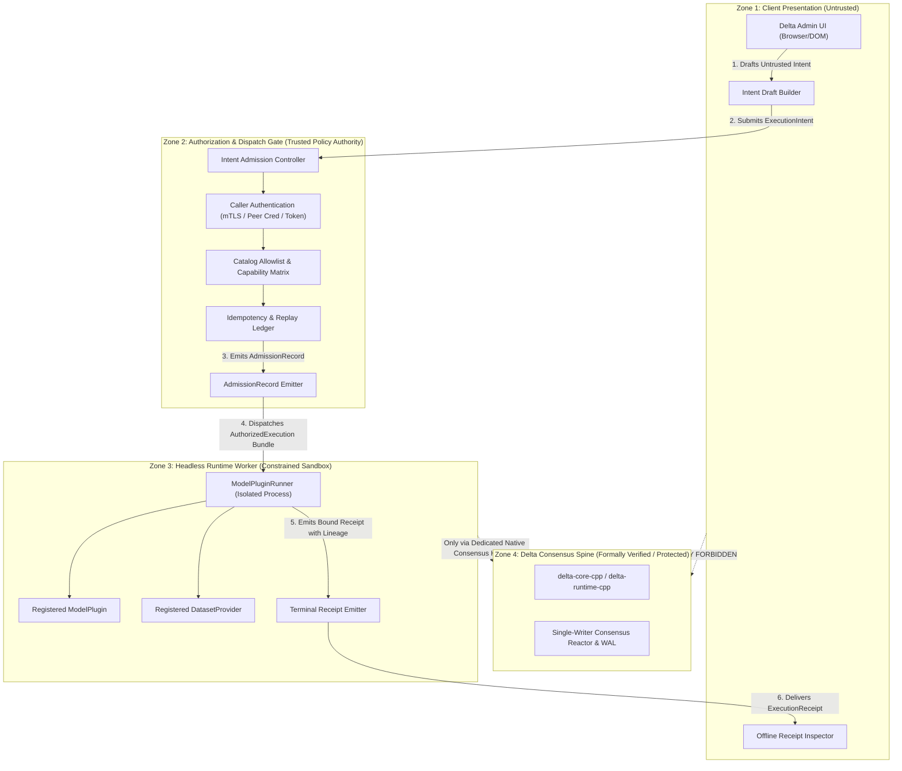
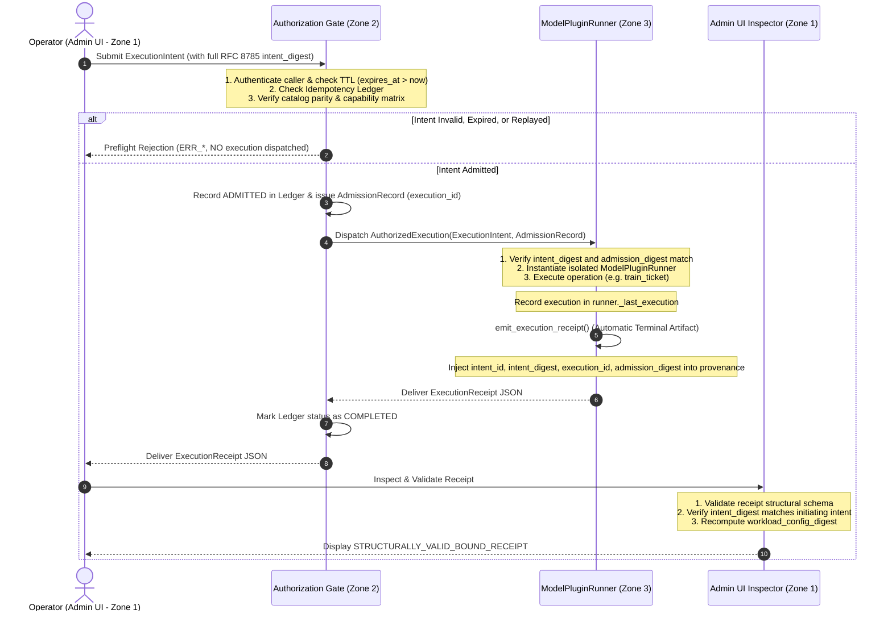

# ADR 0002: Controlled Live Execution Boundary

- **Status**: Proposed
- **Date**: 2026-09-17
- **Scope**: Delta Admin UI & Execution Runtime boundary (Step 5C)
- **Formal impact**: `NONE`

---

## Context

ADR 0001 established the Delta Admin UI as an isolated, browser-local MVP in `tools/admin-ui/`. The UI operates entirely offline with zero backend dependencies, zero credential handling, and zero automated network egress. In the Step 5 extensibility milestone (closed in `main@4992d9e` via PR #32), the UI proved end-to-end catalog extensibility by loading, validating, and binding offline execution receipts for four registered workloads (MNIST, QLoRA, EEG, and 10-Gene Phenotype Centroid) against frozen catalog snapshots.

In all previous steps, execution occurred strictly out-of-band: operators invoked the Python runtime worker (`ModelPluginRunner`) offline via CLI, test suites, or automation harnesses, which emitted canonical `ExecutionReceipt` JSON files that the operator subsequently inspected in the Admin UI.

As the platform evolves toward Step 5C ("Controlled Live Execution"), operators require a path to transition from inspecting static post-hoc receipts to initiating and monitoring authorized workload executions directly. However, introducing live execution into an administrative web interface poses severe architectural and operational risks:
1. **Remote Code Execution (RCE) vector**: Turning an administrative web interface into an arbitrary remote command or script executor breaks the core security boundary of the platform.
2. **Breach of browser-local trust model**: Exposing private signing keys, runtime handles, or cluster credentials inside the browser DOM violates `specs/admin-ui/security-boundaries.md`.
3. **Delta spine pollution**: Exposing native C++ reactor handles (`delta-runtime-cpp`, `delta-core-cpp`) or Java Netty consensus pipelines (`delta-node-java`) to an unvetted UI boundary risks violating the Formal-first STOP rule and TLA+ failure semantics.
4. **Replay and execution ambiguity**: Without strict idempotency, finite TTLs, and cryptographic operation binding, operators could accidentally or maliciously trigger redundant training runs, corrupt local state, or forge cross-workload receipts.

Therefore, before any live-control, network, or daemon code is written, this ADR establishes the formal trust boundaries, intent specification, authorization gate, idempotency model, and audit lineage for controlled live execution.

---

## Decision

We establish a strictly decoupled, declarative **Execution Intent & Dispatch Boundary** between client presentation and runtime execution:

1. **Zero execution authority in the browser**: The Admin UI remains an untrusted presentation and intent-drafting client. It possesses no execution privileges, holds no private keys, and cannot directly start processes, invoke shell commands, or access native C++/Java runtimes.
2. **Declarative, operation-specific `ExecutionIntent` contract**: Execution requests from the UI must be formulated exclusively as declarative, content-addressed `ExecutionIntent` documents. The intent references strictly immutable identifiers (`model_plugin_id`, `dataset_id`, `requested_scope`, `catalog_backend_ref`), an explicit allowed `operation` enum, and a strictly typed `operation_payload`. Arbitrary file paths, shell commands, script code, or runtime flags are strictly forbidden.
3. **Receipt emission is NOT an intent operation**: `emit_execution_receipt` is strictly a terminal execution artifact produced automatically upon successful completion of an authorized workload operation. It cannot be requested as an independent operation.
4. **Full-document canonical digest**: The `intent_digest` is computed over the entire canonical JSON representation (RFC 8785 JCS) of the `ExecutionIntent` (excluding only the `intent_digest` field itself), ensuring that any change to identifiers, payloads, constraints, timestamps, or declared roles invalidates the digest.
5. **Decoupled authorization gate and distinct `AdmissionRecord`**: Drafting an intent in Zone 1 is fundamentally decoupled from authorizing execution in Zone 2. An untrusted intent requires explicit admission by an independent Authorization Gate. The Gate authenticates the caller, evaluates governance policies, and produces a distinct, tamper-evident `AdmissionRecord` containing the verified subject, policy version, and an assigned `execution_id`.
6. **Strict one-intent/one-execution idempotency & TTL**: Intents carry a mandatory `expires_at` timestamp. The Authorization Gate enforces an append-only idempotency ledger: an `intent_id` can be admitted for execution exactly once. Re-submissions return existing execution status or cached receipts idempotently.
7. **Preservation of PR #32 provenance semantics**:
   - `catalog_backend_ref` (and its alias `backend_commit`) strictly identifies the immutable git commit of the frozen catalog snapshot (`source.backend_ref`).
   - `producer_commit` strictly identifies the git commit of the runtime worker that executed the workload.
   - `controller_commit` identifies the commit of the running Authorization Gate binary.
8. **Transport agnosticism**: Transport mechanisms (whether air-gapped file export/import, local loopback Unix domain sockets, named pipes, or an authenticated gateway) are treated as downstream implementation details. The authority model, trust boundaries, and schemas defined herein apply identically regardless of transport.
9. **Zero spine modification**: This decision does not alter `delta-runtime-cpp`, `delta-core-cpp`, `delta-node-java`, or formal TLA+ specifications. Consensus claims (`STAGE_C_REAL_DRQ1`) remain strictly inaccessible to local worker runs lacking a native BFT consensus harness.

---

## Trust Boundaries

The execution architecture is partitioned into four strictly isolated trust zones:



### Zone Invariants

- **Zone 1 (Untrusted Client)**: May only construct declarative data structures conforming to the `ExecutionIntent` schema and inspect digest-bound `ExecutionReceipt` documents. Never holds signing keys, worker processes, or execution handles.
- **Zone 2 (Authorization Gate)**: Trusted policy enforcement point. Authenticates the actual caller (distinct from declared UI identity); verifies that `model_plugin_id` and `dataset_id` exist in the committed catalog; confirms `catalog_backend_ref` matches the catalog snapshot; checks capability matrix; verifies `expires_at > now()`; enforces the one-intent/one-execution idempotency ledger; assigns a unique `execution_id`; and issues an `AdmissionRecord`.
- **Zone 3 (Constrained Runtime Worker)**: Headless Python process (`ModelPluginRunner`). Runs within an isolated sandbox (bounded memory, CPU quota, no arbitrary network egress). Dispatched strictly with an `AuthorizedExecution` bundle. Resolves plugins solely via in-tree registries by ID. Upon completion, automatically emits an `ExecutionReceipt` binding `intent_digest` and `admission_digest`.
- **Zone 4 (Delta Spine)**: Completely isolated from Zones 1, 2, and 3 during local execution. Only engaged when an explicit multi-node native consensus harness is instantiated under Feature 008/010 governance.

---

## ExecutionIntent

An `ExecutionIntent` is an immutable, canonical JSON document specifying *which operation* should be performed on *which workload*, under what constraints, and against which exact catalog revision.

### Allowed Operations

The intent must declare an explicit operation from the following closed enum:
- `TRAIN_TICKET`: Execute local worker ticket training on a dataset partition.
- `EVALUATE_SPLIT`: Evaluate a model against the dataset evaluation split.
- `EVALUATE_CHECKPOINT`: Decode applied checkpoint integer coordinates and evaluate.
- `MATERIALIZE_DATASET`: Ensure dataset sources are pre-materialized and validated fail-closed.

*(Note: `emit_execution_receipt` is deliberately omitted; receipt emission is an automatic terminal step of execution, not an intent operation).*

### Schema Specification (Draft 2020-12)

```json
{
  "$schema": "https://json-schema.org/draft/2020-12/schema",
  "title": "ExecutionIntent",
  "type": "object",
  "required": [
    "schema_version",
    "intent_id",
    "created_at",
    "expires_at",
    "declared_operator",
    "workload",
    "operation",
    "operation_payload",
    "execution_constraints",
    "intent_digest"
  ],
  "additionalProperties": false,
  "properties": {
    "schema_version": {
      "type": "string",
      "const": "1.0.0"
    },
    "intent_id": {
      "type": "string",
      "format": "uuid"
    },
    "created_at": {
      "type": "string",
      "format": "date-time"
    },
    "expires_at": {
      "type": "string",
      "format": "date-time"
    },
    "declared_operator": {
      "type": "object",
      "required": ["subject_id", "role"],
      "additionalProperties": false,
      "properties": {
        "subject_id": { "type": "string", "minLength": 1 },
        "role": { "type": "string", "enum": ["OPERATOR", "RESEARCHER", "AUDITOR"] }
      }
    },
    "workload": {
      "type": "object",
      "required": [
        "model_plugin_id",
        "dataset_id",
        "requested_scope",
        "catalog_backend_ref"
      ],
      "additionalProperties": false,
      "properties": {
        "model_plugin_id": {
          "type": "string",
          "pattern": "^[a-z0-9-]+$"
        },
        "dataset_id": {
          "type": "string",
          "pattern": "^[a-z0-9-]+$"
        },
        "requested_scope": {
          "type": "string",
          "enum": ["PLUGIN_BOUNDARY", "MODEL_DATASET_BINDING_ONLY"]
        },
        "catalog_backend_ref": {
          "type": "string",
          "pattern": "^[0-9a-f]{40}$"
        }
      }
    },
    "operation": {
      "type": "string",
      "enum": [
        "TRAIN_TICKET",
        "EVALUATE_SPLIT",
        "EVALUATE_CHECKPOINT",
        "MATERIALIZE_DATASET"
      ]
    },
    "operation_payload": {
      "type": "object",
      "description": "Operation-specific parameters strictly matching the requested operation"
    },
    "execution_constraints": {
      "type": "object",
      "required": ["timeout_seconds", "allow_downloads"],
      "additionalProperties": false,
      "properties": {
        "timeout_seconds": { "type": "integer", "minimum": 1, "maximum": 3600 },
        "allow_downloads": { "type": "boolean" },
        "retry_attempt": { "type": "integer", "minimum": 0, "default": 0 }
      }
    },
    "intent_digest": {
      "type": "string",
      "pattern": "^sha256:[0-9a-f]{64}$"
    }
  },
  "allOf": [
    {
      "if": { "properties": { "operation": { "const": "TRAIN_TICKET" } } },
      "then": {
        "properties": {
          "operation_payload": {
            "type": "object",
            "required": ["ticket_id", "partition_id"],
            "additionalProperties": false,
            "properties": {
              "ticket_id": { "type": "string", "pattern": "^[A-Za-z0-9_-]+$" },
              "partition_id": { "type": "string", "pattern": "^[A-Za-z0-9_-]+$" }
            }
          }
        }
      }
    },
    {
      "if": { "properties": { "operation": { "const": "EVALUATE_SPLIT" } } },
      "then": {
        "properties": {
          "operation_payload": {
            "type": "object",
            "required": ["split_name"],
            "additionalProperties": false,
            "properties": {
              "split_name": { "type": "string", "enum": ["evaluation", "test"] }
            }
          }
        }
      }
    },
    {
      "if": { "properties": { "operation": { "const": "EVALUATE_CHECKPOINT" } } },
      "then": {
        "properties": {
          "operation_payload": {
            "type": "object",
            "required": ["checkpoint_coordinates"],
            "additionalProperties": false,
            "properties": {
              "checkpoint_coordinates": {
                "type": "array",
                "items": { "type": "integer" },
                "minItems": 1
              },
              "split_name": { "type": "string", "enum": ["evaluation", "test"], "default": "evaluation" }
            }
          }
        }
      }
    },
    {
      "if": { "properties": { "operation": { "const": "MATERIALIZE_DATASET" } } },
      "then": {
        "properties": {
          "operation_payload": {
            "type": "object",
            "additionalProperties": false,
            "properties": {
              "cache_key": { "type": "string", "pattern": "^[A-Za-z0-9_-]+$" }
            }
          }
        }
      }
    }
  ]
}
```

### Full-Document Canonical Digest Calculation (RFC 8785)

To eliminate parsing ambiguities and guarantee that all fields are cryptographically bound, `intent_digest` is calculated using RFC 8785 (JSON Canonicalization Scheme - JCS):

1. Construct the intent object containing all fields except `intent_digest`.
2. Serialize the object to canonical JSON bytes per RFC 8785 (lexicographically sorted UTF-16 keys, no insignificant whitespace, IEEE 754 compliant number formatting).
3. Compute `SHA-256` over the canonical bytes:

```text
canonical_bytes = RFC8785_Canonicalize(ExecutionIntent \ { "intent_digest" })
intent_digest = "sha256:" + hex(sha256(canonical_bytes))
```

Any modification to any field—including `created_at`, `expires_at`, `declared_operator`, `operation`, `operation_payload`, or `execution_constraints`—strictly alters `intent_digest` and triggers fail-closed preflight rejection.

---

## Authorization Boundary & AdmissionRecord

The creation of an `ExecutionIntent` draft in Zone 1 does **not** grant execution authority. The Authorization Gate (Zone 2) acts as an independent, trusted policy enforcement barrier.

### Separation of Declared Identity vs Authenticated Subject

The client in Zone 1 can only provide a *declared* identity (`declared_operator`). Zone 2 independently authenticates the caller via trusted transport credentials (e.g. mTLS client certificate, local IPC `SO_PEERCRED` / Windows named-pipe token, or cryptographic bearer assertion).

Zone 2 evaluates:
1. **Authentication**: Does the authenticated subject possess the required role?
2. **Schema & Digest**: Does the intent strictly satisfy Draft 2020-12, and does `intent_digest` match `RFC8785_Canonicalize(intent)`?
3. **TTL Check**: Is `expires_at > now()` (with maximum allowed lifetime of 900 seconds from `created_at`)?
4. **Catalog Integrity**: Do `model_plugin_id` and `dataset_id` exist in the committed catalog, and does `catalog_backend_ref` match the catalog snapshot's `source.backend_ref`?
5. **Capability Matrix**: Does the plugin/dataset contract support the requested `operation` and `requested_scope`?
6. **Idempotency & Replay**: Has this `intent_id` or `intent_digest` already been admitted or executed?

### Idempotency & Replay Policy

Zone 2 maintains an append-only, durable **Idempotency Ledger**:
- **Key**: `intent_id` (UUID) and `intent_digest`.
- **First Admission**: If the key is unseen and valid, Zone 2 generates a unique `execution_id` (UUID), marks the ledger state as `ADMITTED`, and proceeds to worker dispatch.
- **Concurrent Re-submission**: If a request arrives with an `intent_id` currently in `ADMITTED` or `RUNNING` state, Zone 2 returns `STATUS_IN_PROGRESS` and the assigned `execution_id` without spawning a second worker process.
- **Completed Re-submission**: If a request arrives with an `intent_id` already marked `COMPLETED`, Zone 2 returns the previously emitted `ExecutionReceipt` directly from cache (idempotent result retrieval).
- **Failed Re-submission**: If a previous run failed, re-execution requires an explicit new `intent_id` (or incremented `retry_attempt` within constraints), preventing silent duplicate training.

### AdmissionRecord Schema

Upon successful admission, Zone 2 issues a signed, tamper-evident `AdmissionRecord`:

```json
{
  "$schema": "https://json-schema.org/draft/2020-12/schema",
  "title": "AdmissionRecord",
  "type": "object",
  "required": [
    "schema_version",
    "admission_id",
    "intent_id",
    "intent_digest",
    "execution_id",
    "authenticated_subject",
    "policy_context",
    "resource_grants",
    "admitted_at",
    "admission_digest"
  ],
  "additionalProperties": false,
  "properties": {
    "schema_version": { "type": "string", "const": "1.0.0" },
    "admission_id": { "type": "string", "format": "uuid" },
    "intent_id": { "type": "string", "format": "uuid" },
    "intent_digest": { "type": "string", "pattern": "^sha256:[0-9a-f]{64}$" },
    "execution_id": { "type": "string", "format": "uuid" },
    "authenticated_subject": {
      "type": "object",
      "required": ["subject_id", "authenticated_via", "effective_roles"],
      "additionalProperties": false,
      "properties": {
        "subject_id": { "type": "string" },
        "authenticated_via": { "type": "string", "enum": ["LOCAL_PEER_CREDENTIAL", "MTLS", "TOKEN"] },
        "effective_roles": { "type": "array", "items": { "type": "string" } }
      }
    },
    "policy_context": {
      "type": "object",
      "required": ["policy_version", "controller_commit", "verdict"],
      "additionalProperties": false,
      "properties": {
        "policy_version": { "type": "string" },
        "controller_commit": { "type": "string", "pattern": "^[0-9a-f]{40}$" },
        "verdict": { "type": "string", "const": "ADMITTED" }
      }
    },
    "resource_grants": {
      "type": "object",
      "required": ["max_memory_bytes", "timeout_seconds"],
      "additionalProperties": false,
      "properties": {
        "max_memory_bytes": { "type": "integer" },
        "timeout_seconds": { "type": "integer" }
      }
    },
    "admitted_at": { "type": "string", "format": "date-time" },
    "admission_digest": { "type": "string", "pattern": "^sha256:[0-9a-f]{64}$" }
  }
}
```

The `admission_digest` is computed via RFC 8785 canonicalization over the `AdmissionRecord` (excluding `admission_digest`).

---

## Request → Execution → Receipt Lineage

To ensure complete, tamper-evident auditability, the execution lifecycle maintains an unbroken chain linking the user intent, gate admission, worker execution, and final receipt.



### Provenance Semantics & Schema Alignment

In alignment with the provenance separation established in PR #32, the resulting `ExecutionReceipt` strictly distinguishes:
- `provenance.catalog_backend_ref` (and `backend_commit`): The catalog snapshot git ref (`670b58f6458fe84620f4f9f46401f855d04ae05d`).
- `provenance.producer_commit`: The git SHA of the worker binary/code that produced the receipt.
- `provenance.controller_commit`: The git SHA of the Authorization Gate that admitted the intent.
- `provenance.intent_id` & `provenance.intent_digest`: Direct linkage to the triggering `ExecutionIntent`.
- `provenance.execution_id` & `provenance.admission_digest`: Direct linkage to the authorizing `AdmissionRecord`.

```json
{
  "schema_version": "1.0.0",
  "receipt_type": "DELTAREDUCE_EXECUTION_RECEIPT",
  "provenance": {
    "repository": "chartjs333/delta",
    "backend_commit": "670b58f6458fe84620f4f9f46401f855d04ae05d",
    "catalog_backend_ref": "670b58f6458fe84620f4f9f46401f855d04ae05d",
    "producer_commit": "4992d9eca319da21b5a2c7b94593f3668b92329c",
    "controller_commit": "4992d9eca319da21b5a2c7b94593f3668b92329c",
    "produced_at": "2026-09-17T14:30:00.000Z",
    "intent_id": "9b1deb4d-3b7d-4bad-9bdd-2b0d7b3dcb6d",
    "intent_digest": "sha256:4f83b1239c01...",
    "execution_id": "5c2a1e88-9f12-4e12-8a99-3d1f8b2c4e5a",
    "admission_digest": "sha256:8a1b2c3d4e5f..."
  },
  "workload": {
    "model_plugin_id": "tabular-10gene-phenotype-v1",
    "dataset_id": "synthetic-10gene-cohort-v1",
    "executed_scope": "PLUGIN_BOUNDARY",
    "workload_config_digest": "sha256:93caaf42c2a8f1bacb9fbc9bf835a48a8641fd16c416794a7a0ca7f52a0138c8"
  },
  "execution": {
    "verdict": "SUCCESS",
    "terminal_status": "COMPLETED"
  }
}
```

### Trust Semantics Language Hygiene

In accordance with strict verification standards:
- The receipt is formally designated as a **structurally validated, digest-bound record** (`STRUCTURALLY_VALID_BOUND_RECEIPT`).
- For local runs lacking an asymmetric signature authority, the badge remains **`UNATTESTED_PLUGIN_BOUNDARY_RECORD`**.
- It is strictly forbidden to describe un-signed receipts as "cryptographically signed" or "cryptographically verified". Verification confirms structural conformance, canonical digest equality, and unbroken intent-to-execution linkage.

---

## Allowlisted Operations

The controlled live execution boundary restricts permissible operations to a predefined, immutable set.

### 1. Permissible Workload Operations

| Operation (`operation`) | Worker Entry Point | Allowed Scopes | Description |
| --- | --- | --- | --- |
| `MATERIALIZE_DATASET` | `runner.materialize_dataset()` | `PLUGIN_BOUNDARY`, `MODEL_DATASET_BINDING_ONLY` | Pre-populates and validates local dataset splits fail-closed. |
| `TRAIN_TICKET` | `runner.train_ticket(ticket_id, partition_id)` | `PLUGIN_BOUNDARY` | Executes local ticket training partition and computes local centroid/tensor contribution. |
| `EVALUATE_SPLIT` | `runner.evaluate(model)` | `PLUGIN_BOUNDARY`, `MODEL_DATASET_BINDING_ONLY` | Evaluates a trained model against the dataset evaluation split. |
| `EVALUATE_CHECKPOINT` | `runner.evaluate_checkpoint(coordinates)` | `PLUGIN_BOUNDARY`, `MODEL_DATASET_BINDING_ONLY` | Decodes integer checkpoint coordinates and validates accuracy. |

*(Terminal step: All operations above automatically emit an `ExecutionReceipt` upon successful completion).*

### 2. Operations Strictly Prohibited from Live Trigger

- **Arbitrary script execution**: Executing raw scripts, string code, `eval()`, `exec()`, or unvetted modules.
- **Filesystem path injection**: Specifying custom input/output directories or script paths outside the managed artifact store.
- **Unregistered plugins / datasets**: Supplying plugin names or paths not present in `ModelPluginRegistry` or `DatasetRegistry`.
- **Direct native reactor mutation**: Invoking C++ ABI functions or mutating WAL / consensus state machines.
- **Stage C Consensus fabrication**: Emitting consensus fields (`round_id`, `state_root`, `wal_sequence`) from a local worker run.

### 3. Operations Remaining Strictly Offline & Browser-Local

- Browsing and inspecting catalog descriptors (`tools/registry`).
- Guided controller form drafting, pairwise review editing, and local JSON export.
- Static receipt inspection, cryptographic digest re-computation, and badge presentation.
- Structural schema validation using in-browser Draft 2020-12 validator.

---

## Threat Model & Abuse Cases

| Threat ID | Threat / Attack Vector | Severity | Mitigation & Fail-Closed Guard |
| --- | --- | --- | --- |
| **TM-01** | **Remote Code Execution via UI Input**: Attacker crafts UI inputs containing shell metacharacters, file paths, or Python code strings to achieve arbitrary execution on the worker host. | **Critical** | The UI schema strictly prohibits shell strings, interpreter args, and file paths. Workload selection is limited to strict regex `^[a-z0-9-]+$` identifiers resolved purely through static in-tree registries. Operations are limited to a closed enum. |
| **TM-02** | **Unregistered Plugin Ingestion**: Attacker attempts to pass a custom plugin module or remote URL to execute malicious training logic. | **High** | The Authorization Gate and `ModelPluginRunner` validate IDs against `ModelPluginRegistry` and `DatasetRegistry`. Any unknown ID fails closed before process instantiation (`INVALID_PLUGIN_ID`). |
| **TM-03** | **Intent Tampering / Parameter Modification**: Attacker intercepts an authorized intent and modifies the scope, operation, or parameters before worker execution. | **High** | The intent carries a full-document RFC 8785 `intent_digest`. The worker independently recomputes and verifies the digest against all input fields before execution, rejecting any mismatched payload. |
| **TM-04** | **Replay Attack / Unauthorized Retraining**: Attacker resubmits a previously authorized intent to trigger unwanted redundant training cycles and resource exhaustion. | **High** | Zone 2 Gate maintains an append-only Idempotency Ledger and enforces strict TTL (`expires_at`). Replayed intents return cached receipts or status without executing a second workload. |
| **TM-05** | **Declared Identity Spoofing**: Attacker crafts an intent with `declared_operator: { "role": "OPERATOR" }` to bypass permission checks. | **High** | Zone 2 Authorization Gate ignores declared UI identity for access decisions and evaluates independently authenticated caller credentials (mTLS, peer credentials, or cryptographic tokens), recording the verified subject into `AdmissionRecord`. |
| **TM-06** | **Cross-Runner / Forged Receipt Bypass**: Attacker reuses a receipt from another workload or calls receipt emission on an unexecuted runner. | **High** | Runner instances enforce instance-bound execution tracking (`_last_execution`). Receipts cannot be emitted without prior execution on the exact bound runner instance (`NO_EXECUTION_RECORDED`), and receipts strictly bind `intent_digest` and `admission_digest`. |
| **TM-07** | **Consensus Evidence Forgery**: An operator uses the live execution feature to claim that a local run achieved BFT consensus commitment. | **Critical** | `ModelPluginRunner` strictly forbids emitting `STAGE_C_REAL_DRQ1` receipts without a native consensus harness. Admin UI schema enforces that `PLUGIN_BOUNDARY` receipts must not contain consensus blocks. |
| **TM-08** | **Denial of Service via Infinite Execution**: Attacker triggers intensive workload runs that exhaust CPU/memory resources on the host. | **Medium** | `execution_constraints` enforce mandatory `timeout_seconds` (capped at 3600s), and the Authorization Gate enforces concurrency quotas and resource grants. |

---

## Formal Impact

**Formal impact: `NONE`**

This ADR establishes boundaries purely for client intent dispatch, authorization admission, and worker invocation orchestration. It does not alter, extend, or touch:
1. The formal TLA+ specifications in `specs/000-formal-tla-spec/`.
2. The native C++ core or runtime in `delta-core-cpp` and `delta-runtime-cpp`.
3. The single-writer consensus reactor, durable WAL ordering, vote/QC validation, or state root hash definitions.
4. The canonical accepted formal semantics ID (`sha256:cc98f15ac20fc3ed265cb76682ca15a936e24660a651e2b8f81638abb3265cb6`).

The Formal-first STOP rule remains fully intact: any future proposal that connects live worker execution directly to multi-node consensus transitions must first originate as a formal TLA+ specification change in Feature 000.

---

## Consequences

### Positive

- Establishes an unassailable, fail-closed security boundary for live execution before any live-control code is written.
- Eliminates the risk of turning the Admin UI into an arbitrary remote code execution vector.
- Cryptographically binds the exact operation and payload to the authorization decision via RFC 8785 canonical digest.
- Protects against replay attacks, duplicate training, and identity spoofing via the Idempotency Ledger and `AdmissionRecord`.
- Preserves the offline, browser-local integrity of the existing Admin UI while providing an auditable, verifiable lineage from intent to receipt.
- Correctly preserves the PR #32 separation of `catalog_backend_ref` vs `producer_commit`.

### Negative / Trade-offs

- Direct, interactive live debugging from the browser remains impossible by design; all interactions must conform to predefined catalog operations.
- Requires building the Zone 2 Authorization Gate (controller/daemon) with its Idempotency Ledger before live triggers can function.
- Requires client-side and server-side RFC 8785 JSON canonicalization implementations.

---

## Rejected Alternatives

1. **Including `emit_execution_receipt` as an intent operation**:
   - *Rejected*: Receipt emission is an outcome, not an operation. Permitting an intent to request receipt emission independently invites "receipt-without-execution" bypasses.
2. **Hand-rolled colon-separated string for `intent_digest`**:
   - *Rejected*: Inevitably omits new or nested fields over time (as demonstrated by missing constraints/timestamps). RFC 8785 JCS canonicalization over the entire object provides comprehensive, future-proof coverage.
3. **Trusting client-declared `operator_identity`**:
   - *Rejected*: Untrusted clients can spoof arbitrary roles in JSON payloads. Authorization must rely on transport/gate-authenticated credentials, formalized in `AdmissionRecord`.
4. **Direct browser-driven worker execution (e.g. Pyodide / WebAssembly in browser)**:
   - *Rejected*: In-browser execution cannot handle production model scale (e.g. 8 GB QLoRA, full cohort tensors), lacks native hardware acceleration, and provides no reproducible environment identical to host nodes.
5. **WebSocket / HTTP RPC with arbitrary command strings (e.g. `POST /execute { cmd: "python run.py" }`)**:
   - *Rejected*: Equivalent to unauthenticated Remote Code Execution. Violates the core principle that administrative interfaces must not expose arbitrary process execution capabilities.
6. **Merging worker live-trigger directly into consensus Apply (`STAGE_C_REAL_DRQ1`)**:
   - *Rejected*: Conflating local worker training with multi-node BFT round state transitions violates failure semantics and durability barriers. Consensus commit requires multi-party quorum, certificates, and WAL barriers under Feature 008/010 governance.
7. **Selecting a specific network transport (e.g. gRPC vs REST vs WebSockets) in this ADR**:
   - *Rejected*: Transport is an implementation detail. Fixing a transport before establishing the trust model, authority boundary, and schemas would encourage premature network scaffolding.

---

## Non-goals

1. Implementing network servers, HTTP endpoints, WebSocket listeners, or daemon processes in this increment.
2. Altering existing C++ consensus runtime APIs or Java Netty transport layers.
3. Introducing browser-side credential storage, password managers, or OAuth token refresh flows.
4. Enabling arbitrary shell execution or user-uploaded Python script execution.
5. Modifying existing accepted ADRs (`0000`, `0001`, `0010`) or formal proof obligations.
