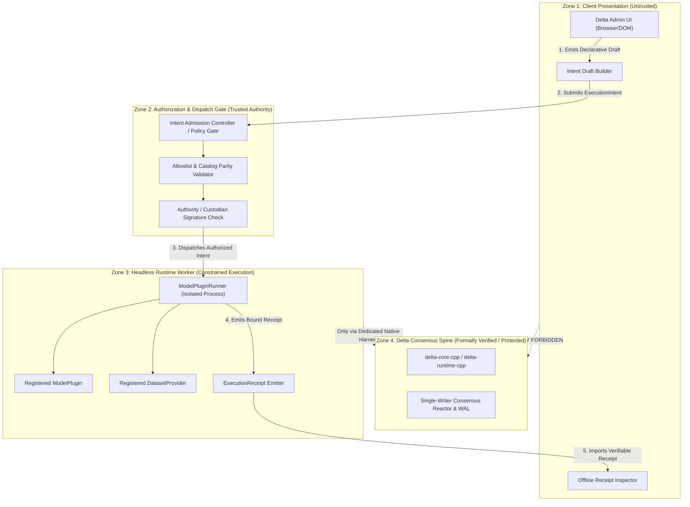
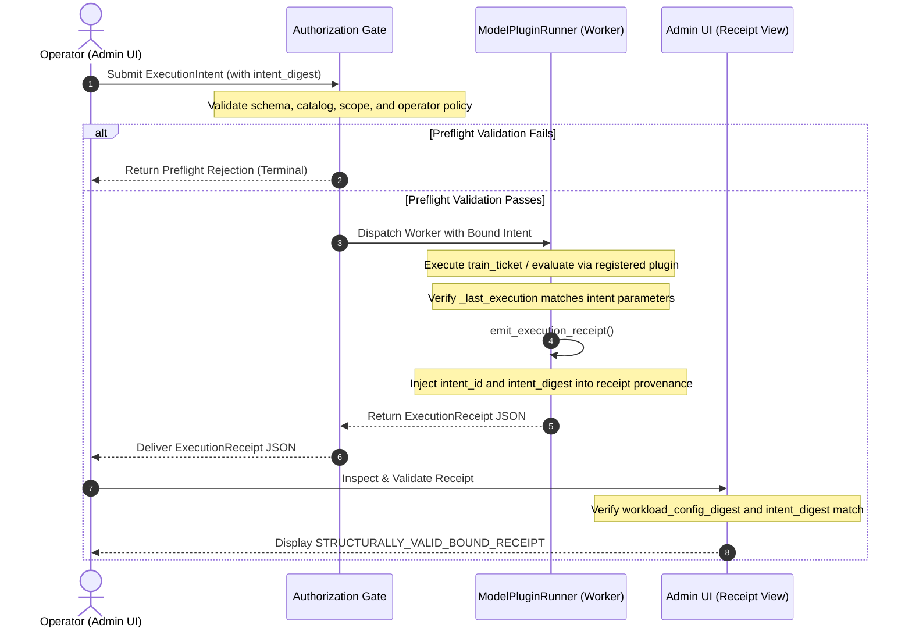

# ADR 0002: Controlled Live Execution Boundary

- **Status**: Proposed
- **Date**: 2026-09-17
- **Scope**: Delta Admin UI & Execution Runtime boundary (Step 5C)
- **Formal impact**: `NONE`

---

## Context

ADR 0001 established the Delta Admin UI as an isolated, browser-local MVP in `tools/admin-ui/`. The UI operates entirely offline with zero backend dependencies, zero credential handling, and zero automated network egress. In the Step 5 extensibility milestone (closed in `main@4992d9e` via PR #32), the UI proved end-to-end catalog extensibility by loading, validating, and binding offline execution receipts for four registered workloads (MNIST, QLoRA, EEG, and 10-Gene Phenotype Centroid) against frozen catalog snapshots.

In all previous steps, execution occurred offline: operators invoked the Python runtime worker (`ModelPluginRunner`) out-of-band via CLI, test suites, or automation harnesses, which emitted canonical `ExecutionReceipt` JSON files that the operator subsequently inspected in the Admin UI.

As the platform evolves toward Step 5C ("Controlled Live Execution"), operators require a path to transition from inspecting static post-hoc receipts to initiating and monitoring authorized workload executions directly. However, introducing live execution into a web interface poses severe architectural and operational risks:
1. **Remote Code Execution (RCE) vector**: Turning an administrative web interface into an arbitrary remote command executor breaks the core security boundary of the platform.
2. **Breach of browser-local trust model**: Exposing private signing keys, runtime handles, or cluster credentials inside the browser DOM violates `specs/admin-ui/security-boundaries.md`.
3. **Delta spine pollution**: Exposing native C++ reactor handles (`delta-runtime-cpp`, `delta-core-cpp`) or Java Netty consensus pipelines (`delta-node-java`) to an unvetted UI boundary risks violating the Formal-first STOP rule and TLA+ failure semantics.

Therefore, before any live-control, network, or daemon code is written, this ADR establishes the formal trust boundaries, intent specification, authorization gate, and audit lineage for controlled live execution.

---

## Decision

We establish a strictly decoupled, declarative **Execution Intent & Dispatch Boundary** between client presentation and runtime execution:

1. **Zero execution authority in the browser**: The Admin UI remains an untrusted presentation and intent-drafting client. It possesses no execution privileges, holds no private keys, and cannot directly start processes, invoke shell commands, or access native C++/Java runtimes.
2. **Declarative `ExecutionIntent` contract**: Execution requests from the UI must be formulated exclusively as declarative, content-addressed `ExecutionIntent` documents. The intent references strictly immutable identifiers (`model_plugin_id`, `dataset_id`, `execution_scope`, `catalog_backend_ref`) from the committed catalog. Arbitrary file paths, shell commands, script code, or runtime flags are strictly forbidden.
3. **Decoupled authorization gate**: Drafting an intent is fundamentally decoupled from authorizing execution. An intent document requires explicit authorization by an independent policy authority (such as a local operator signature, credentialed gateway, or custodian policy daemon) before it can be admitted to an execution queue.
4. **Content-addressed intent-to-receipt lineage**: Every workload execution is deterministically bound to its initiating `ExecutionIntent` via a canonical `intent_digest`. The runtime worker must incorporate the `intent_id` and `intent_digest` into the emitted `ExecutionReceipt`, ensuring an unbroken, tamper-evident audit chain from user intent to verifiable output.
5. **Transport agnosticism**: Transport mechanisms (whether air-gapped file export/import, local loopback Unix/named-pipe sockets, or an authenticated gateway) are treated as implementation details downstream of the authority model. The security invariants and validation rules defined herein apply identically regardless of transport.
6. **Zero spine modification**: This decision does not alter `delta-runtime-cpp`, `delta-core-cpp`, `delta-node-java`, or formal TLA+ specifications. Consensus claims (`STAGE_C_REAL_DRQ1`) remain strictly inaccessible to local worker runs lacking a native BFT consensus harness.

---

## Trust Boundaries

The execution architecture is partitioned into four strictly isolated trust zones:



### Zone Invariants

- **Zone 1 (Untrusted Client)**: May only construct declarative data structures conforming to the `ExecutionIntent` schema and inspect cryptographically verifiable `ExecutionReceipt` documents. Never holds signing keys or execution handles.
- **Zone 2 (Authorization Gate)**: Validates that all requested plugins, datasets, and scopes exist in the committed catalog snapshot; verifies that `catalog_backend_ref` matches the exact deployed commit; and evaluates operator authorization policies before dispatching.
- **Zone 3 (Constrained Runtime Worker)**: Headless Python process (`ModelPluginRunner`). Resolves plugins strictly through in-tree `ModelPluginRegistry` and `DatasetRegistry`. Runs without network egress (except for pre-authorized dataset materialization). Fails closed if invoked with unregistered identifiers. Emits receipts bound to the `intent_digest`.
- **Zone 4 (Delta Spine)**: Completely isolated from Zones 1 and 3 during local execution. Only engaged when an explicit multi-node native consensus harness is instantiated under Feature 008/010 governance.

---

## ExecutionIntent

An `ExecutionIntent` is an immutable, canonical JSON document specifying *what* workload should be executed, under what scope, and against which exact catalog revision.

### Schema Specification

```json
{
  "$schema": "https://json-schema.org/draft/2020-12/schema",
  "title": "ExecutionIntent",
  "type": "object",
  "required": [
    "schema_version",
    "intent_id",
    "created_at",
    "operator_identity",
    "workload",
    "execution_constraints",
    "intent_digest"
  ],
  "additionalProperties": false,
  "properties": {
    "schema_version": {
      "type": "string",
      "const": "1.0.0"
    },
    "intent_id": {
      "type": "string",
      "format": "uuid"
    },
    "created_at": {
      "type": "string",
      "format": "date-time"
    },
    "operator_identity": {
      "type": "object",
      "required": ["subject_id", "role"],
      "additionalProperties": false,
      "properties": {
        "subject_id": { "type": "string", "minLength": 1 },
        "role": { "type": "string", "enum": ["OPERATOR", "RESEARCHER", "AUDITOR"] }
      }
    },
    "workload": {
      "type": "object",
      "required": [
        "model_plugin_id",
        "dataset_id",
        "requested_scope",
        "catalog_backend_ref"
      ],
      "additionalProperties": false,
      "properties": {
        "model_plugin_id": {
          "type": "string",
          "pattern": "^[a-z0-9-]+$"
        },
        "dataset_id": {
          "type": "string",
          "pattern": "^[a-z0-9-]+$"
        },
        "requested_scope": {
          "type": "string",
          "enum": ["PLUGIN_BOUNDARY", "MODEL_DATASET_BINDING_ONLY"]
        },
        "catalog_backend_ref": {
          "type": "string",
          "pattern": "^[0-9a-f]{40}$"
        }
      }
    },
    "execution_constraints": {
      "type": "object",
      "required": ["timeout_seconds", "allow_downloads"],
      "additionalProperties": false,
      "properties": {
        "timeout_seconds": { "type": "integer", "minimum": 1, "maximum": 3600 },
        "allow_downloads": { "type": "boolean" },
        "ticket_id": { "type": "string", "pattern": "^[A-Za-z0-9_-]+$" },
        "partition_id": { "type": "string", "pattern": "^[A-Za-z0-9_-]+$" }
      }
    },
    "intent_digest": {
      "type": "string",
      "pattern": "^sha256:[0-9a-f]{64}$"
    }
  }
}
```

### Canonical Digest Calculation

The `intent_digest` guarantees immutability of the request. It is computed as the SHA-256 hash of a deterministic canonical string encoding the critical parameters:

```text
canonical_intent_string =
  schema_version + ":" +
  intent_id + ":" +
  operator_identity.subject_id + ":" +
  workload.model_plugin_id + ":" +
  workload.dataset_id + ":" +
  workload.requested_scope + ":" +
  workload.catalog_backend_ref + ":" +
  execution_constraints.ticket_id + ":" +
  execution_constraints.partition_id

intent_digest = "sha256:" + hex(sha256(canonical_intent_string.encode('utf-8')))
```

Any modification to any field in `workload` or `execution_constraints` invalidates the digest and causes immediate preflight rejection.

---

## Authorization Boundary

The creation of an `ExecutionIntent` draft does **not** grant execution permission. The authorization boundary acts as a fail-closed gate between client intent and runtime worker invocation:

```text
[Intent Drafted in UI]
         ↓
[Authorization Boundary Evaluation]
   ├─ 1. Schema Validation (Draft 2020-12 strict conformance)
   ├─ 2. Catalog Allowlist Check (model_plugin_id & dataset_id exist in committed catalog)
   ├─ 3. Compatibility Matrix Check (binding capability allows requested_scope)
   ├─ 4. Provenance Parity Check (catalog_backend_ref matches deployed binary commit)
   ├─ 5. Operator Authority Check (signature, bearer token, or air-gapped policy approval)
   └─ 6. Resource Quota & Lock Gate (worker concurrency limit, timeout bounds)
         ↓
  (PASS: Dispatch to Worker)  /  (FAIL: Reject with Preflight Error, emit NO execution)
```

### Preflight Rejection Taxonomy

If any check fails, the Authorization Gate rejects the intent immediately with a structured, non-executable error response:
- `ERR_UNKNOWN_WORKLOAD_DESCRIPTOR`: The requested `model_plugin_id` or `dataset_id` is not present in the frozen registry.
- `ERR_INCOMPATIBLE_BINDING`: The requested scope is not permitted for this plugin/dataset pair (e.g., requesting `STAGE_C_REAL_DRQ1` without native consensus harness, or pairing mismatched domains).
- `ERR_CATALOG_REF_MISMATCH`: The `catalog_backend_ref` does not match the deployed commit hash.
- `ERR_UNAUTHORIZED_OPERATOR`: The operator identity lacks the required role or provides an invalid authorization token.
- `ERR_QUOTA_EXCEEDED`: Concurrency limits, execution time bounds, or memory thresholds are exceeded.

---

## Request → Execution → Receipt Lineage

To ensure complete end-to-end provenance, every execution must maintain an unbroken chain of cryptographic and contextual linkage from the initiating user intent to the final verifiable receipt.



### Receipt Schema Integration

The resulting `ExecutionReceipt` incorporates intent lineage within its `provenance` and `workload` structures:

```json
{
  "schema_version": "1.0.0",
  "receipt_type": "DELTAREDUCE_EXECUTION_RECEIPT",
  "provenance": {
    "repository": "chartjs333/delta",
    "backend_commit": "4992d9eca319da21b5a2c7b94593f3668b92329c",
    "catalog_backend_ref": "4992d9eca319da21b5a2c7b94593f3668b92329c",
    "producer_commit": "4992d9eca319da21b5a2c7b94593f3668b92329c",
    "produced_at": "2026-09-17T14:30:00.000Z",
    "intent_id": "9b1deb4d-3b7d-4bad-9bdd-2b0d7b3dcb6d",
    "intent_digest": "sha256:e3b0c44298fc1c149afbf4c8996fb92427ae41e4649b934ca495991b7852b855"
  },
  "workload": {
    "model_plugin_id": "tabular-10gene-phenotype-v1",
    "dataset_id": "synthetic-10gene-cohort-v1",
    "executed_scope": "PLUGIN_BOUNDARY",
    "workload_config_digest": "sha256:93caaf42c2a8f1bacb9fbc9bf835a48a8641fd16c416794a7a0ca7f52a0138c8"
  },
  "execution": {
    "verdict": "SUCCESS",
    "terminal_status": "COMPLETED"
  }
}
```

---

## Allowlisted Operations

The controlled live execution boundary restricts permissible operations to a predefined, immutable set.

### 1. Operations Allowed for Controlled Live Trigger

| Operation | Execution Entry Point | Allowed Scopes | Description |
| --- | --- | --- | --- |
| **Materialize Dataset** | `runner.materialize_dataset()` | `PLUGIN_BOUNDARY`, `MODEL_DATASET_BINDING_ONLY` | Pre-populates and validates local dataset splits fail-closed. |
| **Train Ticket** | `runner.train_ticket(ticket_id, partition_id)` | `PLUGIN_BOUNDARY` | Executes local ticket training partition and computes local centroid/tensor contribution. |
| **Evaluate Split** | `runner.evaluate(model)` | `PLUGIN_BOUNDARY`, `MODEL_DATASET_BINDING_ONLY` | Evaluates a trained model against the dataset evaluation split. |
| **Evaluate Checkpoint** | `runner.evaluate_checkpoint(coordinates)` | `PLUGIN_BOUNDARY`, `MODEL_DATASET_BINDING_ONLY` | Decodes integer checkpoint coordinates and validates accuracy. |
| **Emit Execution Receipt** | `runner.emit_execution_receipt()` | `PLUGIN_BOUNDARY`, `MODEL_DATASET_BINDING_ONLY` | Generates a validated, signed receipt bound to the executed step. |

### 2. Operations Strictly Prohibited from Live Trigger

- **Arbitrary Python execution**: Executing raw scripts, string code, `eval()`, `exec()`, or unvetted modules.
- **Filesystem navigation**: Specifying arbitrary working directories, input paths, or output paths outside the managed artifact root.
- **Unregistered plugins / datasets**: Supplying plugin names or paths not present in `ModelPluginRegistry` or `DatasetRegistry`.
- **Direct native reactor mutation**: Invoking C++ ABI functions or mutating WAL / consensus state machines.
- **Stage C Consensus fabrication**: Emitting consensus fields (`round_id`, `state_root`, `wal_sequence`) from a local worker run.

### 3. Operations Remaining Strictly Offline & Browser-Local

- Browsing and inspecting catalog descriptors (`tools/registry`).
- Guided controller form drafting, pairwise review editing, and local JSON export.
- Static receipt inspection, cryptographic digest re-computation, and badge presentation.
- Structural schema validation using in-browser Draft 2020-12 validator.

---

## Threat Model & Abuse Cases

| Threat ID | Threat / Attack Vector | Severity | Mitigation & Fail-Closed Guard |
| --- | --- | --- | --- |
| **TM-01** | **Remote Code Execution via UI Input**: Attacker crafts UI inputs containing shell metacharacters, file paths, or Python code strings to achieve arbitrary execution on the worker host. | **Critical** | The UI schema strictly prohibits shell strings, interpreter args, and file paths. Workload selection is limited to strict regex `^[a-z0-9-]+$` identifiers resolved purely through static in-tree registries. |
| **TM-02** | **Unregistered Plugin Ingestion**: Attacker attempts to pass a custom plugin module or remote URL to execute malicious training logic. | **High** | The Authorization Gate and `ModelPluginRunner` validate IDs against `ModelPluginRegistry` and `DatasetRegistry`. Any unknown ID fails closed before process instantiation (`INVALID_PLUGIN_ID`). |
| **TM-03** | **Intent Tampering / Confused Deputy**: Attacker intercepts an authorized intent and modifies the scope or parameters before worker execution. | **High** | The intent carries a content-addressed `intent_digest`. The worker independently recomputes and verifies the digest against all input fields before execution, rejecting any mismatched payload. |
| **TM-04** | **Cross-Runner / Forged Receipt Bypass**: Attacker reuses a receipt from another workload or calls receipt emission on an unexecuted runner. | **High** | Runner instances enforce instance-bound execution tracking (`_last_execution`). Receipts cannot be emitted without prior execution on the exact bound runner instance (`NO_EXECUTION_RECORDED`). |
| **TM-05** | **Consensus Evidence Forgery**: An operator uses the live execution feature to claim that a local run achieved BFT consensus commitment. | **Critical** | `ModelPluginRunner` strictly forbids emitting `STAGE_C_REAL_DRQ1` receipts without a native consensus harness. Admin UI schema enforces that `PLUGIN_BOUNDARY` receipts must not contain consensus blocks. |
| **TM-06** | **Denial of Service via Infinite Execution**: Attacker triggers intensive workload runs that exhaust CPU/memory resources on the host. | **Medium** | `execution_constraints` enforce mandatory `timeout_seconds` (capped at 3600s), and the Authorization Gate enforces concurrency quotas. |

---

## Formal Impact

**Formal impact: `NONE`**

This ADR establishes boundaries purely for client intent dispatch and worker invocation orchestration. It does not alter, extend, or touch:
1. The formal TLA+ specifications in `specs/000-formal-tla-spec/`.
2. The native C++ core or runtime in `delta-core-cpp` and `delta-runtime-cpp`.
3. The single-writer consensus reactor, durable WAL ordering, vote/QC validation, or state root hash definitions.
4. The canonical accepted formal semantics ID (`sha256:cc98f15ac20fc3ed265cb76682ca15a936e24660a651e2b8f81638abb3265cb6`).

The Formal-first STOP rule remains fully intact: any future proposal that connects live worker execution directly to multi-node consensus transitions must first originate as a formal TLA+ specification change in Feature 000.

---

## Consequences

### Positive

- Establishes a rigorous, fail-closed security boundary for live execution before any live-control code is written.
- Eliminates the risk of turning the Admin UI into an arbitrary remote code execution vector.
- Preserves the offline, browser-local integrity of the existing Admin UI while creating an explicit, auditable contract for live interaction.
- Provides cryptographic lineage (`intent_digest` → `ExecutionReceipt`) connecting user actions to verified results.
- Maintains strict zero-modification isolation over the core Delta consensus spine.

### Negative / Trade-offs

- Direct, interactive live debugging from the browser remains impossible by design; all interactions must conform to predefined catalog operations.
- Requires an independent Authorization Gate component (daemon/controller) to be designed and implemented before live triggers can be used in production.
- Adds an additional cryptographic digest check (`intent_digest`) to the execution pipeline.

---

## Rejected Alternatives

1. **Direct browser-driven worker execution (e.g. Pyodide / WebAssembly in browser)**:
   - *Rejected*: In-browser execution cannot handle production model scale (e.g. 8 GB QLoRA, full cohort tensors), lacks native hardware acceleration, and provides no reproducible environment identical to host nodes.
2. **WebSocket / HTTP RPC with arbitrary command strings (e.g. `POST /execute { cmd: "python run.py" }`)**:
   - *Rejected*: Equivalent to unauthenticated or weakly authenticated Remote Code Execution. Violates the core principle that administrative interfaces must not expose arbitrary process execution capabilities.
3. **Merging worker live-trigger directly into consensus Apply (`STAGE_C_REAL_DRQ1`)**:
   - *Rejected*: Conflating local worker training with multi-node BFT round state transitions violates failure semantics and durability barriers. Consensus commit requires multi-party quorum, certificates, and WAL barriers under Feature 008/010 governance.
4. **Selecting a specific network transport (e.g. gRPC vs REST vs WebSockets) in this ADR**:
   - *Rejected*: Transport is a secondary implementation detail. Fixing a transport before establishing the trust model and authority boundary would encourage building premature network scaffolding.

---

## Non-goals

1. Implementing network servers, HTTP endpoints, WebSocket listeners, or daemon processes in this increment.
2. Altering existing C++ consensus runtime APIs or Java Netty transport layers.
3. Introducing browser-side credential storage, password managers, or OAuth token refresh flows.
4. Enabling arbitrary shell execution or user-uploaded Python script execution.
5. Modifying existing accepted ADRs (`0000`, `0001`, `0010`) or formal proof obligations.
