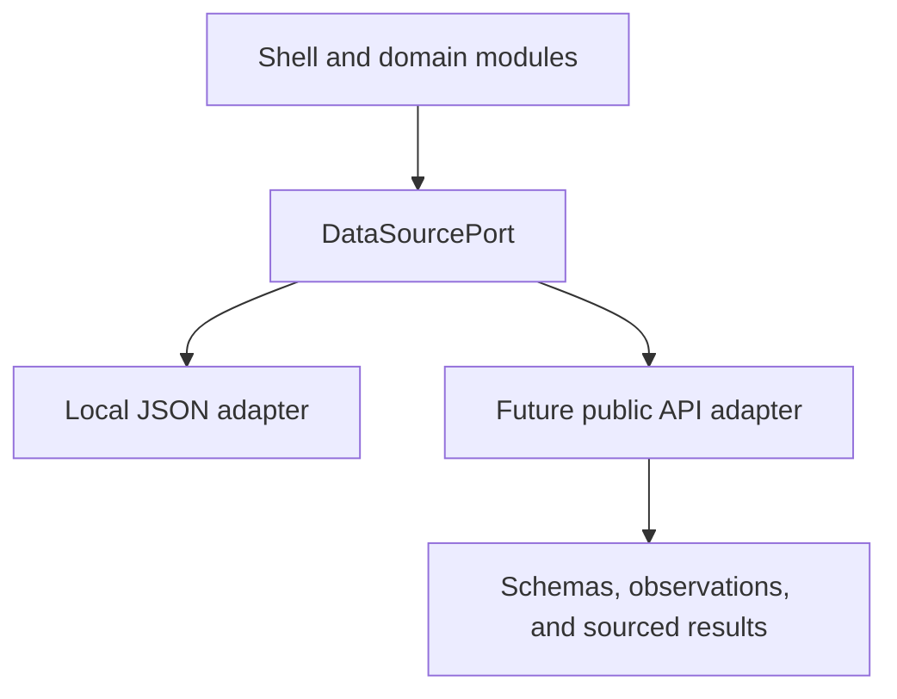

# Architecture: Extensible Administrative Shell

## Dependency direction

The admin UI depends on public contracts and sources. Delta never depends on the UI.

The UI must not call native C ABI/FFM entry points, inspect C++ runtime state, or
reconstruct protocol semantics from transport effects.

## Layers

### Shell

Owns layout, navigation, theme, authorization presentation, global notifications,
source selection, and shared loading/error behavior. It contains no domain verdicts.

### Domain modules

Own routes and views for one area. Initial module: `controllers`. Reserved future
areas: `campaigns`, `nodes`, `artifacts`, and `audit`.

### Presentation models

Adapt source documents for display. Any derived value is presentation-only,
traceable to its inputs, and never exported as canonical data unless the governing
schema explicitly defines it.

### DataSourcePort

The only domain-facing data boundary. It exposes source descriptors, schemas,
documents, capabilities, and sourced results through stable contracts.

### Adapters

`LocalJsonAdapter` enables the offline MVP. A future `DeltaApiAdapter` may consume
public APIs after those APIs have stable contracts. Adapters do not repair,
complete, or semantically reinterpret source data.

## Extension points

| Extension ID class | Purpose | Required descriptor fields |
| --- | --- | --- |
| `navigation` | Add a route/menu entry | stable ID, label, route, permission |
| `domain-module` | Add a bounded feature area | stable ID, routes, views, required capabilities |
| `entity-view` | Add table/card/graph/timeline views | entity type, view ID, input contract, fallback |
| `dashboard-widget` | Add an overview widget | stable ID, data requirements, empty/error behavior |
| `data-adapter` | Add a source | adapter ID, authority class, capabilities, lifecycle |
| `visualization` | Add a renderer | renderer ID, input contract, unsupported fallback |

Extensions are registered at a documented composition root. Editing that registry
is expected; editing unrelated modules is not.

## Authority classes

The presentation must keep these classes distinct:

1. `LOCAL_DRAFT`: operator-authored or imported bytes with no asserted authority.
2. `STRUCTURAL_VALIDATION`: schema conformance only.
3. `OBSERVATION`: sourced operational data without protocol finality.
4. `GOVERNANCE_ASSESSMENT`: a result attributed to an identified governance authority.
5. `PROTOCOL_RESULT`: a result provided by a canonical Delta validator/API/artifact.

The UI cannot promote data to a stronger authority class. A result can be displayed
only with its subject binding and provenance.

## Compatibility

- Canonical schemas are addressed by ID and version.
- Unsupported schema versions fail explicitly.
- Unknown allowed fields survive import/export.
- Unknown capabilities are ignored safely.
- Adapter errors are localized and mapped to typed presentation states.
- Visualization inputs retain source and retrieval metadata.
