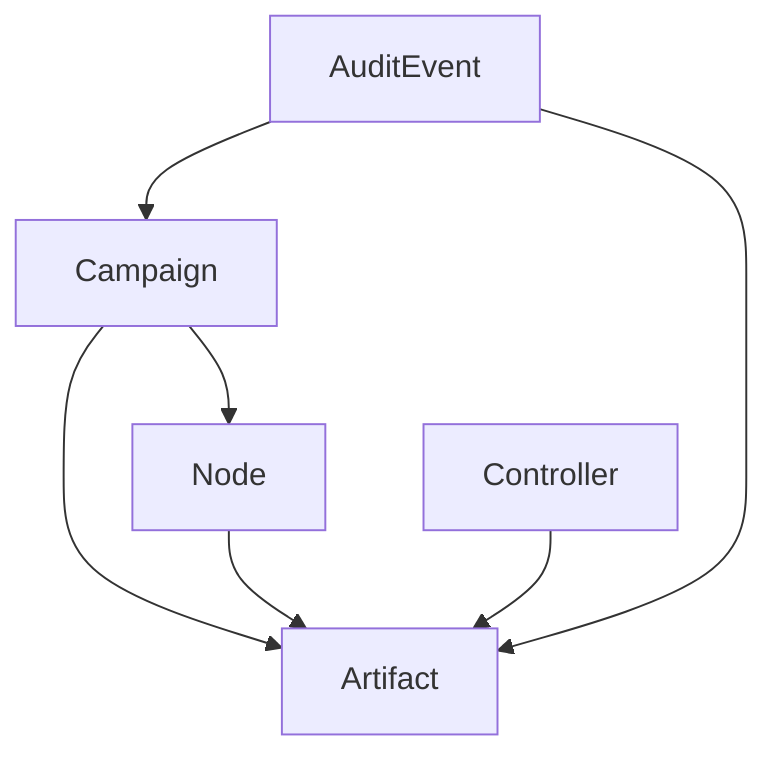

# Logical Data Model

This model supports navigation and presentation. It neither creates canonical
Delta types nor supersedes schemas in `delta-protocol`.

## Controller

Potential source fields include canonical ID, display label, identity type,
public-key identifiers, public custody metadata, evidence references, sourced
statuses, timestamps, and document version. Exact fields come from the selected schema.

The collection is unbounded by the UI. A four-controller `f_b=1` worksheet from
PR #29 is one fixture, not the generic cardinality.

## Campaign

A source-defined view of a coordinated process or round. Relationships may include
nodes, contributions, aggregate artifacts, status history, and audit events.

## Node

A source-defined view of a participant and observable status. The UI does not infer
trust, eligibility, or validator membership from labels or connectivity.

## Artifact

A content-addressed or externally referenced result. Presentation distinguishes
metadata, content reference, provenance, availability observation, and verification result.

## AuditEvent

An immutable event view with event ID, timestamp/logical time, actor, action,
target, outcome, correlation ID, and evidence/artifact references when supplied.

## SourceDescriptor

Identifies an adapter instance and its authority class, capabilities, connection
state, supported schemas/entity types, freshness, and retrieval metadata.

## SourcedResult

Contains result type, outcome, exact subject reference, authority class, source
reference, issued/retrieved times, verifier or policy revision when available,
and evidence/signature references when available.

## Relationships

Relationships require explicit IDs/references. Display-name coincidence does not
establish a relationship.
